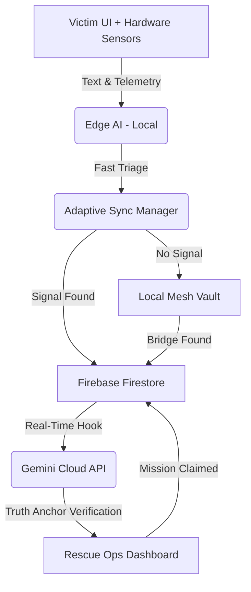

# 🏗️ SYNC BRIDGE: TECHNICAL ARCHITECTURE GUIDE

This guide explains the "Invisible Backend" of Sync Bridge for the 2026 Google Hackathon.

## 1. The Mobile Layer (Flutter)
The `mobile-app/` directory contains the native Flutter implementation. 
*   **Role:** While the Web App (React) is great for instant demos, the **Flutter App** is the "Production" version.
*   **Capability:** It uses native hardware APIs to keep the **Mesh Network** alive even when the phone screen is off.

## 2. The Intelligence Layer (Hybrid AI)
We use a **Dual-Layer Intelligence** system to guarantee speed offline, and hyper-accuracy online.
*   **Layer 1 (Edge AI):** A local TensorFlow Lite Micro model runs on-device. It categorizes the SOS text instantly, even in total communication blackouts.
*   **Layer 2 (The Truth Anchor):** When the cloud is reachable, the Gemini API takes over. It acts as a "Truth Anchor," cross-referencing the victim's text against their phone's hardware telemetry (Heart Rate, Motion, Noise). If a victim types "I'm fine" but sensors read 145 BPM, Gemini flags a **SENSORY_CONFLICT** to the rescue team.

## 3. The Sync Layer (Firebase Spark Plan)
Since we are using the **Free Tier (Spark)**, we avoid Cloud Functions and use **Real-Time Synchronization**.
*   **Firestore:** Acts as a global "Shared Mesh" state.
*   **Offline Persistence:** Firebase's built-in offline cache allows the app to "queue" data when disconnected and "auto-sync" the moment a network is found.

---

## 🛰️ DATA FLOW DIAGRAM

## 🛰️ Hybrid Sync Engine (Adaptive Connectivity)

The Sync Bridge protocol is designed for the "Edge of the Map," where connectivity is a luxury, not a guarantee. The system automatically shifts between three operational tiers:

1.  **LEVEL 1: TOTAL_BLACKOUT (Offline AI)**
    *   **Behavior:** Zero connectivity detected. 
    *   **Action:** 100% of the intelligence is handled on-device. Local inference classifies the SOS, and the packet is buffered in a local vault.
2.  **LEVEL 2: ULTRA_LIGHT_SYNC (Patchy Internet)**
    *   **Behavior:** Extremely low bandwidth or 1% signal strength detected.
    *   **Action:** The system switches to an **Ultra-Light Sync** mode. It uses our bit-packed binary protocol to send only the most critical 12-byte headers. This allows an SOS to reach the command center even over a connection too weak for a standard web page.
3.  **LEVEL 3: NOMINAL_SYNC (High Bandwidth)**
    *   **Behavior:** Standard network connection restored.
    *   **Action:** Full real-time synchronization with the Firebase Cloud. All metadata, telemetry, and detailed reasoning logs are uplinked to the global mission map.

## 📝 Judge's Explanation Script
*"Judges, Sync Bridge uses a revolutionary Hybrid AI Architecture. During a disaster, the phone's Edge AI works offline to ensure the SOS is routed even if the internet is down. But when the packet hits our dashboard, our Gemini-powered 'Truth Anchor' takes over. It doesn't just read the text; it cross-references the victim's words against the phone's hardware sensors. If someone is in shock and types 'I'm okay,' but their heart rate is 150 BPM and the accelerometer shows impact, Gemini flags a sensory conflict, allowing our rescue teams to see the truth past the panic."*
