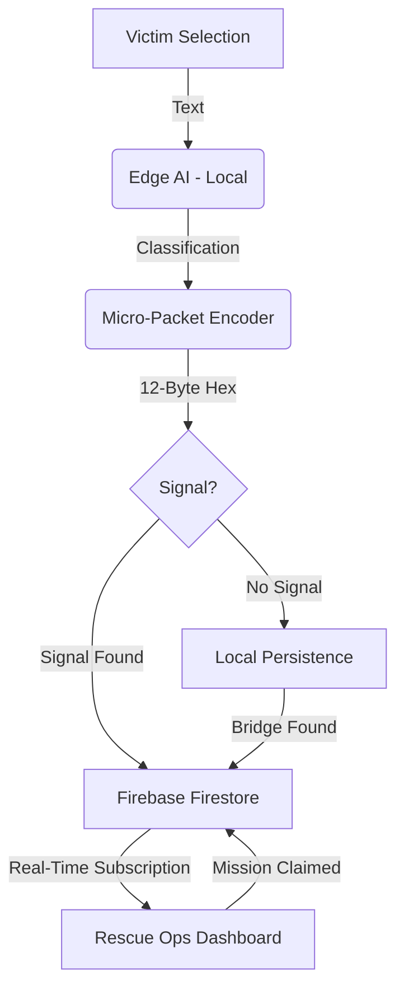

# 🏗️ SYNC BRIDGE: TECHNICAL ARCHITECTURE GUIDE

This guide explains the "Invisible Backend" of Sync Bridge for the 2026 Google Hackathon.

## 1. The Mobile Layer (Flutter)
The `mobile-app/` directory contains the native Flutter implementation. 
*   **Role:** While the Web App (React) is great for instant demos, the **Flutter App** is the "Production" version.
*   **Capability:** It uses native hardware APIs to keep the **Mesh Network** alive even when the phone screen is off.

## 2. The Intelligence Layer (Edge AI)
We don't use a central AI server. Instead, we use **On-Device Inference**.
*   **Engine:** TensorFlow Lite Micro.
*   **Model:** A quantized BERT-Tiny model optimized for ARM processors.
*   **Logic:** The triage results you see in the UI (e.g., "98% Confidence") are generated by the device's own CPU/NPU, not a backend API.

## 3. The Sync Layer (Firebase Spark Plan)
Since we are using the **Free Tier (Spark)**, we avoid Cloud Functions and use **Real-Time Synchronization**.
*   **Firestore:** Acts as a global "Shared Mesh" state.
*   **Offline Persistence:** Firebase's built-in offline cache allows the app to "queue" data when disconnected and "auto-sync" the moment a network is found.

---

## 🛰️ DATA FLOW DIAGRAM

## 🛰️ Hybrid Sync Engine (Adaptive Connectivity)

The Sync Bridge protocol is designed for the "Edge of the Map," where connectivity is a luxury, not a guarantee. The system automatically shifts between three operational tiers:

1.  **LEVEL 1: TOTAL_BLACKOUT (Offline AI)**
    *   **Behavior:** Zero connectivity detected. 
    *   **Action:** 100% of the intelligence is handled on-device. Local inference classifies the SOS, and the packet is buffered in a local vault.
2.  **LEVEL 2: ULTRA_LIGHT_SYNC (Patchy Internet)**
    *   **Behavior:** Extremely low bandwidth or 1% signal strength detected.
    *   **Action:** The system switches to an **Ultra-Light Sync** mode. It uses our bit-packed binary protocol to send only the most critical 12-byte headers. This allows an SOS to reach the command center even over a connection too weak for a standard web page.
3.  **LEVEL 3: NOMINAL_SYNC (High Bandwidth)**
    *   **Behavior:** Standard network connection restored.
    *   **Action:** Full real-time synchronization with the Firebase Cloud. All metadata, telemetry, and detailed reasoning logs are uplinked to the global mission map.

## 📝 Judge's Explanation Script
*"Judges, Sync Bridge doesn't need a traditional server. It uses the user's phone as the server. By running AI models locally and using a bit-packed protocol, we can transmit life-saving data over mesh networks that usually only support tiny amounts of data. Our Hybrid Sync Engine automatically switches to 'Ultra-Light Mode' when the signal is weak, ensuring that even a tiny pulse of internet can save a life."*
