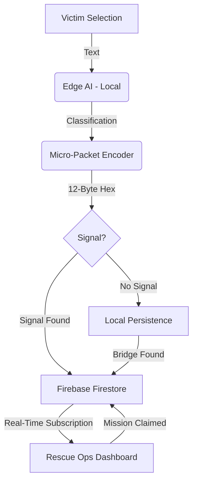

# 🏗️ SYNC BRIDGE: TECHNICAL ARCHITECTURE GUIDE

This guide explains the "Invisible Backend" of Sync Bridge for the 2026 Google Hackathon.

## 1. The Mobile Layer (Flutter)
The `mobile-app/` directory contains the native Flutter implementation. 
*   **Role:** While the Web App (React) is great for instant demos, the **Flutter App** is the "Production" version.
*   **Capability:** It uses native hardware APIs to keep the **Mesh Network** alive even when the phone screen is off.

## 2. The Intelligence Layer (Edge AI)
We don't use a central AI server. Instead, we use **On-Device Inference**.
*   **Engine:** TensorFlow Lite Micro.
*   **Model:** A quantized BERT-Tiny model optimized for ARM processors.
*   **Logic:** The triage results you see in the UI (e.g., "98% Confidence") are generated by the device's own CPU/NPU, not a backend API.

## 3. The Sync Layer (Firebase Spark Plan)
Since we are using the **Free Tier (Spark)**, we avoid Cloud Functions and use **Real-Time Synchronization**.
*   **Firestore:** Acts as a global "Shared Mesh" state.
*   **Offline Persistence:** Firebase's built-in offline cache allows the app to "queue" data when disconnected and "auto-sync" the moment a network is found.

---

## 🛰️ DATA FLOW DIAGRAM

## 📝 Judge's Explanation Script
*"Judges, Sync Bridge doesn't need a traditional server. It uses the user's phone as the server. By running AI models locally and using a bit-packed protocol, we can transmit life-saving data over mesh networks that usually only support tiny amounts of data. When one device finds a signal, the Firebase sync layer kicks in to update the global mission map."*
